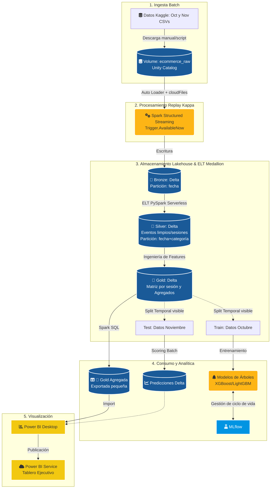
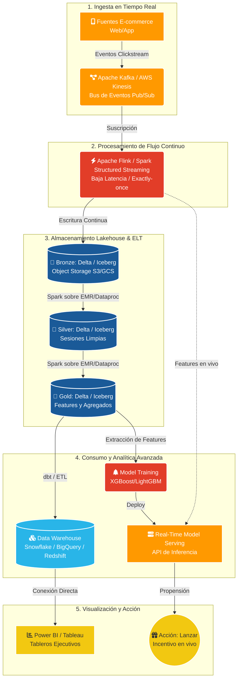

# Optimización de la conversión en e-commerce mediante modelado de propensión de compra y segmentación de visitantes para diagnosticar la fuga de conversión

**Nombre del equipo:** Grupo 8

Sara Martínez, Kelly Enrriquez, Heider Zapata, Yeison Londoño

> Documento corregido de la propuesta del proyecto (original en `material_entrega/propuesta_original.docx`). Materializa el texto acordado en el chat del Proyecto (`04_propuesta_texto_acordado.md`) sobre la estructura de la propuesta original. Las secciones **Problema** e **Impacto** están marcadas como PROVISIONAL (se curarán contra el informe final). Ver pendientes al cierre.

---

## Problema del negocio

La industria del comercio electrónico (e-commerce) multicategoría opera en un entorno de alta competencia donde la toma de decisiones ocurre en milisegundos. En este ecosistema, las plataformas capturan flujos masivos de datos conocidos como clickstream (logs de eventos), que registran cada interacción de los usuarios: desde la visualización de un producto hasta la transacción final.

A pesar de la abundancia de información, el sector enfrenta una ineficiencia estructural crítica: la tasa de conversión promedio. Según los estándares globales de la industria, solo entre el 1 % y el 3 % de las sesiones de navegación terminan en una compra efectiva (Statista, 2024; Adobe Digital Insights, 2023). Esto significa que aproximadamente el 98 % del tráfico atraído —muchas veces mediante altos costos de adquisición de clientes (CAC)— no genera ingresos directos.

Desde una perspectiva de Decision Science, el problema no es solo la baja conversión, sino la dificultad de saber *dónde* y *sobre quién* concentrar el esfuerzo de recuperación. Muchas empresas aplican incentivos ("nudges": cupones, descuentos, envíos gratis) de manera genérica, lo que produce dos fallos económicos:

- **Erosión del excedente del productor:** se otorga un descuento a un usuario que ya tenía una alta propensión de compra y habría adquirido el producto al precio original.
- **Costo de oportunidad:** se pierden ventas potenciales al no identificar a usuarios "indecisos" que, con un incentivo marginal, habrían convertido.

Este proyecto propone transformar logs de eventos desestructurados en un sistema de soporte a decisiones que diagnostique dónde y por qué se fuga la conversión y qué visitantes la explican. El reto se desglosa en tres dimensiones críticas:

- **Dimensión de Big Data:** la ingesta y transformación de 14 GB de datos crudos mediante procesamiento distribuido (Apache Spark) para reconstruir sesiones de usuario y generar una matriz de características conductuales a partir de eventos atómicos.
- **Dimensión de Machine Learning:** el desarrollo de modelos capaces de operar bajo un desbalanceo extremo de clases (97 % no-compra), prediciendo la propensión basada en la recencia de clics, la profundidad de navegación y la comparación de marcas sustitutas.
- **Dimensión de Decision Science (del diagnóstico a la decisión de negocio):** la transición de la predicción a una decisión defendible. En lugar de afirmar el efecto causal de un incentivo —no estimable con datos observacionales—, el proyecto identifica *dónde* y *por qué* se fuga la conversión y *qué tipos de visitante* la explican, entregando un diagnóstico accionable sobre dónde concentrar el esfuerzo de recuperación. Como complemento final, se esboza el diseño de un experimento controlado que, en una fase posterior, permitiría medir el efecto de un incentivo sobre el segmento de mayor intención.

---

## Impacto de la solución

La implementación de esta solución analítica trasciende la simple predicción, impactando tres frentes estratégicos de la organización:

### A. Impacto económico y de rentabilidad

- **Foco del margen:** identificar qué segmentos concentran la fuga permite dirigir el esfuerzo de retención donde rinde, en lugar de repartir incentivos genéricos que erosionan el margen en clientes que ya iban a comprar.
- **Recuperación de conversión potencial:** el diagnóstico revela los puntos de abandono del embudo y los tipos de visitante indecisos que el marketing genérico ignora, señalando dónde existe conversión recuperable.
- **Base para el ROI de marketing:** al ordenar visitantes por propensión y caracterizar segmentos, se sientan las bases para que una intervención futura —validada por experimento— dirija el gasto donde el retorno esperado es mayor.

### B. Impacto técnico y escalabilidad

- **Infraestructura de datos robusta:** el uso de formatos Parquet y procesamiento en Spark establece una arquitectura de referencia capaz de escalar a volúmenes de datos aún mayores, permitiendo a la empresa analizar el comportamiento de millones de usuarios sin degradación del rendimiento.
- **Pipeline reproducible:** un pipeline de datos estructurado (Medallion sobre Delta) reduce la dependencia de procesos manuales y deja el diagnóstico listo para alimentar decisiones de negocio de forma trazable y reproducible.

### C. Impacto estratégico y de cliente

- **Decisiones focalizadas en evidencia:** el diagnóstico mueve a la organización de una asignación genérica de incentivos hacia una focalización basada en dónde está realmente la fuga y qué visitantes la explican, sustentada en datos y no en intuición.
- **Honestidad metodológica como estándar:** el proyecto distingue explícitamente lo que los datos observacionales permiten afirmar (propensión, segmentación, diagnóstico) de lo que exigiría un experimento controlado (el efecto causal de un incentivo). Adoptar esa distinción —y dejar diseñado el experimento que sí lo mediría— instala una cultura de decisiones defendibles, alineada con la práctica rigurosa de experimentación en producto.

---

## Marco teórico

El reto central de este proyecto —transformar 14 GB de logs de comportamiento en decisiones de negocio defendibles sobre dónde recuperar conversión, en un escenario donde solo entre el 1 % y el 3 % de las sesiones culminan en compra— exige integrar cuatro capacidades técnicas en secuencia lógica.

La primera es de **infraestructura**: sin procesamiento distribuido, los datos no son computables. Apache Spark paraleliza la reconstrucción de sesiones de usuario sobre múltiples nodos, y el formato columnar Parquet reduce el costo de entrada/salida al leer únicamente las columnas necesarias para el análisis (Zaharia et al., 2016; Vohra, 2016).

Sobre esa base procesada, el **modelado predictivo** enfrenta un desbalanceo extremo de clases. Métodos de ensamble basados en árboles —Random Forest (bagging) y gradient boosting como XGBoost o LightGBM— capturan patrones de conversión sin que la clase mayoritaria domine las predicciones, y estrategias como Balanced Random Forest o el aprendizaje sensible al costo penalizan con mayor peso los errores sobre la clase minoritaria (Breiman, 2001; Chen & Guestrin, 2016; Ke et al., 2017). En este régimen, la métrica adecuada no es el *accuracy* —un clasificador trivial "todo negativo" alcanzaría ~98 % de acierto y 0 % de recall—, sino el área bajo la curva Precision-Recall (PR-AUC) y el F1-Score, que reflejan el desempeño sobre el evento raro (Saito & Rehmsmeier, 2015). La probabilidad estimada se convierte en acción mediante un umbral que se define como política operativa según el costo del error, no por el 0.5 por defecto; y se reporta la calibración del modelo (curva de calibración + Brier score) además de su capacidad de discriminación, porque la salida alimenta una decisión.

Predecir *quién* compra, sin embargo, no agota el problema. Como señalan Sismeiro y Bucklin (2004) y Lemon y Verhoef (2016), cada evento de navegación es una señal posicional dentro del *customer journey* que precede a la transacción; esa lectura sostiene las dos piezas que complementan al clasificador: el **diagnóstico del embudo de conversión** (dónde y por qué se abandona) y la **segmentación no supervisada de tipos de visitante** mediante clustering, cuyo cruce con la propensión revela qué segmento concentra la fuga. El valor económico último estaría en saber a quién un incentivo marginal movería a comprar, pero esa es una pregunta **causal**: el Uplift Modeling estima ese efecto incremental (el CATE) únicamente cuando existen datos experimentales con grupo tratado y grupo de control (Devriendt et al., 2018; Moraes et al., 2023). Nuestro dataset es **observacional** —no contiene variable de tratamiento—, por lo que el uplift **no es estimable**: no es una limitación del modelo, sino del diseño de los datos. El proyecto se mantiene, por tanto, en lo que los datos sí permiten afirmar: propensión, segmentación y diagnóstico de la fuga. Como **cierre opcional**, y para responder a la observación del revisor —la detección de un prospecto (clasificación) y la evaluación de un tratamiento (experimento) son fases distintas—, se esboza el diseño de un experimento controlado (A/B test) que permitiría medir, en una fase posterior, el efecto de un incentivo sobre el segmento de mayor intención (Kohavi, Tang & Xu, 2020); no se afirma ningún efecto causal a partir de los datos observacionales actuales.

Finalmente, estos resultados no son accionables sin **mediación visual**. La visualización analítica —embudo de conversión, variación de la probabilidad de compra según las características del visitante, y perfil de los segmentos— cierra el ciclo convirtiendo la salida del modelo en decisiones comprensibles para perfiles no técnicos (Few, 2009).

---

## Descripción de datos a utilizar

- **Nombre del Dataset:** eCommerce behavior data from multi category store (REES46).
- **Origen y Fuente:** Michael Kechinov, CTO de la plataforma de personalización REES46. Publicado originalmente en Kaggle (Kechinov, 2020).
- **Naturaleza de los Datos:** Logs de comportamiento en tiempo real (clickstream) de una tienda multi-categoría masiva. No son datos sintéticos, sino registros de interacciones reales de usuarios anonimizados.
- **Volumen y Formato:**
  - **Tamaño:** 2 archivos nombrados "2019-Nov.csv" y "2019-Oct.csv", con un tamaño de 9 GB y 5.7 GB, respectivamente (aprox. 40 a 60 millones de eventos por mes).
  - **Formato original:** CSV (será transformado a Parquet para optimización en Spark).
- **Variables:**
  - **Temporales:** `event_time` (timestamp del evento).
  - **Conductuales:** `event_type` (view, cart, remove_from_cart, purchase).
  - **Del Producto:** `product_id`, `category_id`, `category_code` (taxonomía del producto), `brand`, `price`.
  - **Del Usuario:** `user_id`, `user_session` (ID único de la sesión de navegación).
  - **Total Variables:** 9
- **Anonimización:** SÍ.
- **¿Esta base de datos es pública?** SÍ.

---

## Metodología a emplear (CRISP-DM)

Para el desarrollo del presente proyecto se adoptará la metodología CRISP-DM (Cross-Industry Standard Process for Data Mining), dado su enfoque integral y su capacidad para estructurar proyectos de analítica avanzada en contextos de datos masivos y problemas de negocio complejos como la optimización de la conversión en e-commerce.

La metodología CRISP-DM constituye un estándar ampliamente adoptado en proyectos de analítica y ciencia de datos debido a su enfoque estructurado, iterativo y orientado al negocio. Este modelo organiza el desarrollo de soluciones analíticas en seis fases interrelacionadas: entendimiento del negocio, entendimiento de los datos, preparación de los datos, modelado, evaluación y despliegue. Su principal fortaleza radica en que no se limita a la construcción de modelos predictivos, sino que integra todo el ciclo de vida del proyecto, desde la definición del problema hasta la implementación de soluciones en entornos reales. En contextos de Big Data y Machine Learning, como el análisis de datos de comportamiento en e-commerce, CRISP-DM permite gestionar la complejidad de grandes volúmenes de información y asegurar que los modelos desarrollados generen valor tangible para la toma de decisiones.

*Ilustración 1. Flujo CRISP-DM*

De esta manera, el flujo de trabajo se ejecutará a través de las siguientes fases:

**Entendimiento del negocio:** se traduce el reto de la baja conversión (1 %–3 %) en preguntas analíticas. La pregunta central es **dónde y por qué se fuga la conversión y qué tipos de visitante la explican**, de modo que el negocio pueda focalizar el esfuerzo de recuperación. Se definen los indicadores que describen la fuga (tasas del embudo: view → cart → purchase; abandono de carrito) y el criterio de éxito analítico: un clasificador de propensión que discrimine sesiones con intención de compra bajo desbalanceo extremo, una segmentación de visitantes accionable, y un diagnóstico que conecte ambos. La estimación del efecto causal de un incentivo queda fuera de alcance por ser observacionales los datos; se aborda, como complemento, mediante el diseño de un experimento que la mediría.

**Entendimiento de los datos:** se realizará un diagnóstico del dataset clickstream (logs de eventos). Dado el volumen masivo, se utilizarán técnicas de analítica visual (Funnels) para identificar los puntos de abandono en el viaje del usuario. Se evaluará la calidad de las variables (timestamps, eventos, precios) y se caracterizará estadísticamente el desbalanceo crítico entre sesiones de navegación y transacciones.

**Preparación de los datos:** fase central de ingeniería de datos mediante Apache Spark. Se realizará la transformación de formatos crudos (CSV) a Parquet para optimizar el I/O. Se ejecutará la *sessionization* (agrupación de eventos por usuario y tiempo) y se construirán características conductuales (recencia, frecuencia de interacción, profundidad de navegación). La construcción de *features* respeta un **corte anti-fuga**: solo se usa el comportamiento **previo** al primer evento `cart`/`purchase` de la sesión, evitando que información posterior al desenlace contamine la predicción.

**Modelado:** se entrenarán algoritmos de Ensemble Learning (LightGBM o XGBoost) debido a su alta eficiencia en procesamiento distribuido y manejo de datos tabulares masivos. Se explorarán técnicas de Cost-Sensitive Learning y Balanced Random Forest para mitigar el efecto del desbalanceo de clases, buscando un score de propensión por cada sesión. De forma paralela, mediante **aprendizaje no supervisado (clustering)** se identifican tipos de visitante (escalado, K-Means, *k* por codo/silhouette cruzado con interpretación), cuyo perfil se cruza con la propensión para el diagnóstico.

**Evaluación:** los modelos no se evalúan por *accuracy* (sesgo de la clase mayoritaria), sino mediante la curva Precision-Recall, F1-Score y PR-AUC, complementadas con la **calibración** del score (curva de calibración + Brier) por alimentar una decisión. El **umbral** de clasificación se define como **política operativa** según el costo del error, no por el 0.5 por defecto.

**Despliegue:** la solución se integra en un entorno tecnológico escalable (apoyado en la arquitectura de la materia de Grandes Datos). En el alcance académico, el despliegue consiste en la **persistencia del modelo y el scoring batch** de las sesiones a una tabla Delta, consumida por un **tablero en Power BI** conectado a la capa Gold agregada, que materializa el diagnóstico para la toma de decisiones. La ruta de procesamiento (replay estilo Kappa con Structured Streaming) está diseñada de modo que el mismo código operaría sobre un flujo en vivo en un escenario de producción, cerrando el ciclo entre el dato y la decisión sin afirmar una operación en tiempo real que el alcance no implementa.

---

## Lista de actividades a realizar en el proyecto para lograr el objetivo

Se presenta la hoja de ruta técnica y administrativa para la ejecución del proyecto, integrando la gestión de código y la documentación final:

- **Definición y arquetipo:** delimitación del problema de negocio y diseño de la arquitectura de referencia en la nube para el procesamiento distribuido.
- **Ingesta y diagnóstico:** adquisición del dataset de REES46 y ejecución del Análisis Exploratorio de Datos (EDA) para identificar patrones conductuales iniciales.
- **Ingeniería de datos y repositorio:** transformación de logs crudos a Parquet y configuración del repositorio GitHub para asegurar la reproducibilidad del código PySpark.
- **Desarrollo analítico:** entrenamiento de modelos supervisados (propensión de compra) y creación de visualizaciones descriptivas de negocio.
- **Validación técnica:** pruebas de desempeño de los modelos y evaluación del impacto económico potencial de una intervención focalizada.
- **Consolidación de entregables:** redacción del documento técnico final, diseño de la presentación ejecutiva y limpieza del repositorio de código.
- **Sustentación y difusión:** presentación oficial de resultados y comunicación de hallazgos del proyecto.

---

## Cronograma de planeación semanal

| Fase / Actividad principal | Periodo de ejecución | May (W1) | May (W2) | May (W3) | May (W4) | Jun (W5) |
|---|---|:--:|:--:|:--:|:--:|:--:|
| Business Understanding | 27-abr al 10-may | X | | | | |
| Data Understanding | 04-may al 10-may | X | | | | |
| Data Prep. & Repositorio GitHub | 11-may al 17-may | | X | | | |
| Modeling & Visuals (Desc.) | 18-may al 24-may | | | X | | |
| Evaluation | 25-may al 31-may | | | | X | |
| Elaboración de Documento Final | 18-may al 08-jun | | X | X | X | X |
| Presentación y Sustentación | 01-jun al 09-jun | | | | | X |

---

## Métodos, modelos, aplicación y tecnología en cada una de las materias del Proyecto Integrador 1

### Curso 1: SI7009/SI6002 Aprendizaje Automático

La metodología de aprendizaje automático opera sobre la matriz de características por sesión construida en la fase de preparación. Los eventos de navegación (*clickstream*) se reconstruyen en sesiones de usuario mediante *sessionization* en Apache Spark y se materializan como tabla de *features* en formato columnar (Delta/Parquet). En la **arquitectura de referencia** (producción), esa ingesta provendría de un bus de eventos en vivo (Kafka/Kinesis); en la **arquitectura implementada** (académica), proviene del replay batch de los CSV históricos sobre la misma ruta de Structured Streaming. Sobre esa base se construyen variables conductuales —recencia de interacción, profundidad de exploración, número de productos vistos, comparación entre marcas— respetando un **corte anti-fuga**: solo se usa el comportamiento previo al primer evento `cart`/`purchase` de la sesión, de modo que ninguna señal posterior al desenlace contamine la predicción.

El problema se formula como una **clasificación binaria supervisada**: la unidad es la sesión y la etiqueta positiva es "la sesión contiene una compra (`purchase`)". Dado que la conversión ronda el 2 %, el evento positivo es raro, y el diseño experimental se construye para ser defendible antes que vistoso. Se establece primero un **baseline explícito** —un clasificador trivial (`DummyClassifier`) que expone por qué el *accuracy* es engañoso bajo este desbalanceo, y un baseline probabilístico (regresión logística) como referencia honesta— antes de introducir modelos más complejos. La comparación entre modelos se mantiene justa: misma métrica, misma validación y mismo preprocesamiento para todos, de modo que cualquier mejora sea atribuible al modelo y no a un cambio simultáneo de varias condiciones.

Como modelos principales se evalúan métodos de ensamble basados en árboles —Random Forest (bagging) y *gradient boosting* (XGBoost, LightGBM)—, elegidos por su desempeño sobre datos tabulares de gran escala y no por moda, comparando al menos dos familias. Para el desbalanceo extremo se incorporan, **dentro del pipeline de cada partición de validación** (nunca sobre todo el dataset, para evitar fuga), estrategias de `class_weight` o remuestreo (SMOTE), tratadas como hipótesis a comparar y no como receta automática. La validación usa un **split temporal** —octubre entrena, noviembre prueba—, justificado porque replica las condiciones de producción (predecir el futuro con información del pasado) y evita la fuga de futuro que una validación aleatoria introduciría en datos con dependencia temporal; el principio rector es que "el futuro no puede entrenar el modelo que evalúa el pasado". El ajuste de hiperparámetros se realiza como diseño experimental con búsqueda bayesiana (Optuna) sobre validación cruzada estratificada, documentando los **rangos evaluados** de cada hiperparámetro (profundidad, `learning_rate`, número de estimadores, regularización) y seleccionando por el promedio **y** la variabilidad entre folds, no por el mejor resultado aislado.

La evaluación comparativa emplea métricas adecuadas al evento raro —**precision, recall, F1-Score y el área bajo la curva Precision-Recall (PR-AUC)**—, más informativas que el *accuracy* (un clasificador "todo negativo" alcanzaría ~98 % de acierto y 0 % de recall) y que la curva ROC bajo positivos escasos. Se reporta además la **calibración** del score (curva de calibración + Brier score), porque la probabilidad estimada alimenta una decisión y discriminar bien no equivale a estar bien calibrado. El **umbral** que convierte la probabilidad en acción se define como política operativa según el costo del error y la capacidad de intervención, no por el 0.5 por defecto, y se acompaña de una matriz de confusión con umbral ajustable que explicita el costo de cada tipo de error (ventas perdidas por falsos negativos frente a esfuerzo desperdiciado por falsos positivos). Para el diagnóstico de qué variables explican la conversión se parte de la **importancia nativa del modelo** (`feature_importances_` / importancia por permutación); de manera complementaria, un análisis de impacto por variable (gráfico tipo SHAP) permite leer la **dirección y magnitud** del efecto —cómo varía la probabilidad de compra según cada característica—, traduciendo el modelo a lenguaje de negocio.

En paralelo al clasificador, una línea de **aprendizaje no supervisado (clustering)** identifica tipos de visitante a partir del comportamiento de sesión. La metodología es explícita: escalado de variables (parte de la definición de similitud), reducción de dimensión con PCA para inspección, K-Means con selección de *k* por el codo y la silueta **cruzada con la interpretabilidad** —"el mejor *k* no es el que maximiza una métrica, sino el que sostiene una partición defendible"—, y perfilado de cada grupo. Se aplica el criterio de que **un *cluster* no es un segmento** mientras no pueda nombrarse, dimensionarse, perfilarse y accionarse de forma diferenciada. El **cruce entre la propensión y los segmentos** es donde nace el insight del proyecto: qué tipo de visitante concentra la alta intención y dónde se fuga la conversión, lo que define el segmento objetivo del diagnóstico —y, como complemento final, del experimento que se esboza para medir una intervención—.

### Curso 2: SI7006/SI6003 Almacenamiento y Procesamiento de Grandes Datos

El componente de ingeniería de datos se organiza explícitamente en **dos arquitecturas**, y esa distinción es en sí misma un entregable que demuestra criterio: una **arquitectura de referencia** (cómo se construiría el sistema en producción con eventos en vivo) y una **arquitectura implementada** (lo que realmente corre sobre Databricks Free Edition con los datos históricos). El principio rector del curso —"no existe una arquitectura universal; se elige por SLA, volumen, costo y gobernanza"— sostiene la decisión central: como el dataset es **histórico** (no hay una fuente de eventos en vivo), la elección correcta es procesamiento batch con un *replay* de estilo Kappa, no un streaming en tiempo real inventado.

En la **arquitectura de referencia**, la ingesta de *clickstream* se haría mediante un bus de eventos distribuido —Apache Kafka o AWS Kinesis—, caracterizado por su escalabilidad, tolerancia a fallos y modelo publicador–suscriptor; el procesamiento de baja latencia correría sobre Apache Flink o Spark Structured Streaming con manejo de estado, ventanas y *watermarks* para datos tardíos, bajo semánticas de entrega *exactly-once* cuando la decisión lo exige; y el consumo incluiría *serving* en tiempo real. Estas tecnologías se nombran con su rol y su *por qué* para demostrar amplitud, pero no se implementan: hacerlo sin una fuente en vivo sería agregar tecnología solo por aparentar.

La **arquitectura implementada** sigue el ciclo de vida del dato sobre un **Lakehouse** en Databricks. Los CSV históricos se tratan como un **log reproducible** (la fuente de verdad del enfoque Kappa) y se procesan con la *misma* ruta de código de Structured Streaming que en producción consumiría Kafka: Auto Loader con `Trigger.AvailableNow()` y *checkpoints*, leyendo los datos como micro-batches (replay liviano, sin broker ni productor). El almacenamiento adopta el patrón **Medallion en Delta Lake**: **Bronze** (clickstream crudo e inmutable, reprocesable sin re-descargar de Kaggle), **Silver** (eventos limpios, tipados y deduplicados, sesiones reconstruidas) y **Gold** (matriz de *features* por sesión y agregados de negocio para BI). Delta aporta transaccionalidad ACID, *time travel*, *schema enforcement* y la unificación de batch y streaming sobre Parquet columnar, cuya ventaja en analítica (*column* y *predicate pushdown*, mayor compresión) justifica preferirlo a CSV plano. El procesamiento de las tres capas corre en **PySpark** bajo un patrón **ELT** (se carga crudo y se transforma dentro del lakehouse, aprovechando el cómputo distribuido sobre almacenamiento barato), cuidando minimizar el *shuffle* —la operación más costosa— mediante agregaciones tempranas y *broadcast joins* cuando un lado es pequeño; en particular, el *join* que construye la Gold se revisa con criterio de estrategia de *join* para evitar sesgo.

La **estrategia de particionamiento se define por capa** según los patrones de consulta reales y no los de ingesta, evitando el anti-patrón de particionar por alta cardinalidad (`user_id`, `user_session`, timestamp exacto), que generaría millones de micro-archivos. Bronze se organiza por fecha de evento (alineada al replay incremental); Silver y Gold se particionan por columnas de filtro frecuente (fecha y categoría) con tamaños de archivo en el rango de 128 MB–1 GB y `ZORDER` sobre las columnas de mayor selectividad. Esta decisión no es cosmética: un buen particionamiento reduce las particiones escaneadas por consulta, lo que **mejora el tiempo de respuesta y, de paso, cuida la cuota de cómputo serverless** de Databricks Free Edition. El flujo refleja además la **separación entre el momento de entrenamiento y el de prueba** —el *split* temporal octubre/noviembre— de modo que la frontera train/test sea visible en el diagrama del pipeline.

El **consumo y despliegue**, en el alcance académico, consiste en consultas analíticas con **Spark SQL** sobre la Gold, la persistencia del modelo y su *scoring* batch a una tabla Delta (gestionados con MLflow), y un tablero en **Power BI** conectado a la **Gold agregada** (no a las decenas de millones de filas crudas), que materializa el diagnóstico para la decisión de negocio. La gobernanza se apoya en Unity Catalog y Volumes, con separación de las zonas cruda (Bronze), curada (Silver) y de consumo (Gold). Todo el diseño está pensado para escalar: el mismo código Spark/Delta operaría sobre cómputo mayor y una fuente en streaming, de modo que la arquitectura implementada es una versión acotada —no distinta— de la de referencia.

*Ilustración 2. Arquitectura de datos implementada para E-commerce (Estilo Kappa en Databricks Free).*

*Ilustración 3. Arquitectura de referencia para E-commerce (Producción en Tiempo Real).*

### Curso 3: SI7007/SI6004 Visualización de Datos

El componente de visualización opera en **dos niveles**, cada uno con un público y un objetivo comunicativo definidos —principio rector del curso: una visualización exploratoria sirve al analista para descubrir, una aclaratoria sirve al tomador de decisiones para actuar—.

El **nivel analítico** está dirigido al equipo técnico durante la evaluación de modelos; su objetivo comunicativo es **informar**. Se construye en Python (Matplotlib, Seaborn, Plotly) e incluye la **curva Precision-Recall** —más informativa que la ROC bajo el desbalanceo severo (~2 % de conversión)—, la **matriz de confusión con umbral ajustable** que explicita el costo económico de cada error (ventas perdidas por falsos negativos frente a esfuerzo desperdiciado por falsos positivos), la **curva de calibración** del score, y un gráfico de **impacto por variable** que muestra cómo varía la probabilidad de compra según las características del visitante. Estos visuales sustituyen a los de uplift (curva de Qini, cuadrantes de uplift) que el alcance ya no contempla.

El **nivel ejecutivo** está dirigido a un **único público —el tomador de decisiones de negocio— con un objetivo comunicativo de convencer e informar**: responder, en pocos segundos de interacción, dónde se concentra la fuga de conversión y qué segmento de visitantes representa la mayor oportunidad de recuperarla (la "Pregunta de Oro" del proyecto). Se materializa en un **tablero en Power BI** publicado en Power BI Service y conectado a la capa Gold agregada. El diseño se rige por los principios del curso: cada vista responde una pregunta de negocio con el **tipo de gráfico adecuado a esa pregunta** —embudo o barras para localizar dónde se abandona el funnel; box plot o dispersión por cuadrantes para contrastar segmentos; treemap o barras apiladas para la composición por categoría—, con jerarquía visual y contraste (color reservado al elemento crítico, grises para el contexto) y un argumento visual explícito por cada gráfica (declaración + conector + razón → acción). Las anotaciones integran el mensaje en la propia gráfica, y los ejes se rotulan con claridad para que la lectura sea legible incluso en proyección.

El **diseño detallado del tablero** —selección final de vistas, filtros e interacciones— se define en la fase final del proyecto, conforme se consolidan los resultados del modelado y la segmentación, de modo que cada visual quede fundamentado en un hallazgo real y no en un supuesto. La herramienta principal es Power BI por su accesibilidad en la maestría y su conexión directa a la Gold; un tablero analítico en Python (Plotly Dash o Streamlit) queda como alternativa equivalente para el nivel técnico.

---

## Consideraciones requeridas para el desarrollo del proyecto

**En datos:**

- **Volumen masivo:** debido a que el dataset supera los 14 GB de registros crudos, existe una restricción de hardware; el procesamiento no podrá realizarse mediante herramientas locales convencionales (Pandas/Excel), requiriendo obligatoriamente un entorno de computación distribuida (Apache Spark).
- **Licenciamiento:** el uso de los datos está sujeto a la licencia Creative Commons Attribution 4.0 International (CC BY 4.0), lo que obliga a la atribución debida al autor original (Michael Kechinov / REES46) en todos los productos derivados.
- **Anonimato:** aunque los datos ya vienen anonimizados de origen, el proyecto se restringe a no intentar realizar procesos de des-anonimización de los identificadores de usuario (`user_id`).

**En código:**

- **Reproducibilidad:** el código deberá ser desarrollado bajo estándares que permitan su ejecución en clústeres de Big Data (estándar PySpark).

**Divulgación:**

- **Finalidad académica:** los resultados, modelos y visualizaciones derivadas de este proyecto tienen un fin estrictamente académico y de portafolio profesional, no pudiendo ser comercializados como una solución de software sin previa revisión de términos de terceros.
- **Atribución:** cualquier publicación de resultados en redes profesionales (como LinkedIn o GitHub) deberá referenciar la fuente de datos de Michael Kechinov y el marco de la Maestría en Ciencia de Datos y Analítica (MCDA).

---

## Bibliografía

- Adobe. (2023). *Adobe Digital Index: E-commerce conversion rates and consumer behavior report*. Adobe Experience Cloud.
- Breiman, L. (2001). Random forests. *Machine Learning, 45*(1), 5–32.
- Chen, T., & Guestrin, C. (2016). XGBoost: A scalable tree boosting system. *Proceedings of the 22nd ACM SIGKDD International Conference on Knowledge Discovery and Data Mining*, 785–794.
- Devriendt, F., Moldovan, D., & Verbeke, W. (2018). A literature survey and experimental evaluation of the state-of-the-art in uplift modeling. *Big Data, 6*(1), 13–41. https://doi.org/10.1089/big.2017.0104
- Few, S. (2009). *Now you see it: Simple visualization techniques for quantitative analysis*. Analytics Press.
- Ke, G., Meng, Q., Finley, T., Wang, T., Chen, W., Ma, W., Ye, Q., & Liu, T. (2017). LightGBM: A highly efficient gradient boosting decision tree. *Advances in Neural Information Processing Systems, 30*.
- Kechinov, M. (2020). *eCommerce behavior data from multi category store* [Conjunto de datos]. Kaggle. https://www.kaggle.com/datasets/mkechinov/ecommerce-behavior-data-from-multi-category-store
- Kohavi, R., Tang, D., & Xu, Y. (2020). *Trustworthy Online Controlled Experiments: A Practical Guide to A/B Testing*. Cambridge University Press.
- Lemon, K. N., & Verhoef, P. C. (2016). Understanding customer experience throughout the customer journey. *Journal of Marketing, 80*(6), 69–96. https://doi.org/10.1509/jm.15.0420
- Moraes, F., Proença, H. M., Kornilova, A., Albert, J., & Goldenberg, D. (2023). *Uplift modeling: From causal inference to personalization*. arXiv. https://arxiv.org/abs/2308.09066
- Saito, T., & Rehmsmeier, M. (2015). The precision-recall plot is more informative than the ROC plot when evaluating binary classifiers on imbalanced datasets. *PLoS ONE, 10*(3).
- Sismeiro, C., & Bucklin, R. E. (2004). Modeling purchase behavior at an e-commerce web site: A task-completion approach. *Journal of Marketing Research, 41*(3), 306–323. https://doi.org/10.1509/jmkr.41.3.306.35985
- Statista. (2024). *Average e-commerce website conversion rate by industry*. Statista Research Department. https://www.statista.com
- Vohra, D. (2016). *Practical Apache Spark*. Apress.
- Wolfinbarger, M., & Gilly, M. C. (2003). eTailQ: Dimensionalizing, measuring and predicting etail quality. *Journal of Retailing, 79*(3), 183–198. https://doi.org/10.1016/S0022-4359(03)00034-4
- Zaharia, M., Chowdhury, M., Franklin, M., Shenker, S., & Stoica, I. (2016). Apache Spark: A unified engine for big data processing. *Communications of the ACM, 59*(11), 56–65.

**Nota de inclusión:** Kohavi, Tang & Xu (2020) se añade a la bibliografía para respaldar el diseño del A/B test (ya citada en el Marco teórico); resuelve la decisión que el texto acordado dejaba abierta.

**Nota de reubicación (sin borrado):** Devriendt et al. (2018) y Moraes et al. (2023) se conservan en la bibliografía, pero en el Marco teórico ahora respaldan el **límite** del uplift (qué exige y por qué no aplica a datos observacionales), no la entrega.

---

## Pendientes (decisiones abiertas que arrastra esta propuesta)

1. **Curar Problema + Impacto contra el informe final:** ambas secciones están marcadas PROVISIONAL; afinar para no sobrevender una vez existan resultados reales.
2. **Diagrama (Ilustración 2):** al rehacerse debe reflejar la frontera train/test (split temporal) y las dos arquitecturas (referencia vs. implementada).
3. **SHAP:** queda como capa complementaria ("gráfico tipo SHAP"), nunca como "lo visto en clase" (el profe Terán enseña `feature_importances_`). No reformular como contenido del curso.

**Resueltos en esta versión:** la cita **Kohavi (2020)** quedó integrada en la bibliografía y el Marco teórico; la **sincronización del particionamiento por capa** se documentó en `02_arquitectura_bigdata_y_databricks.md` (doc 02).
